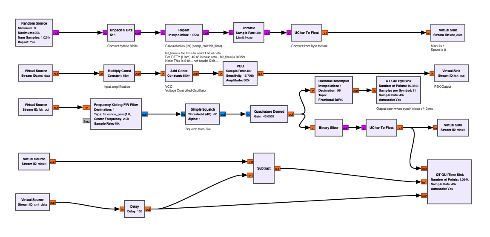
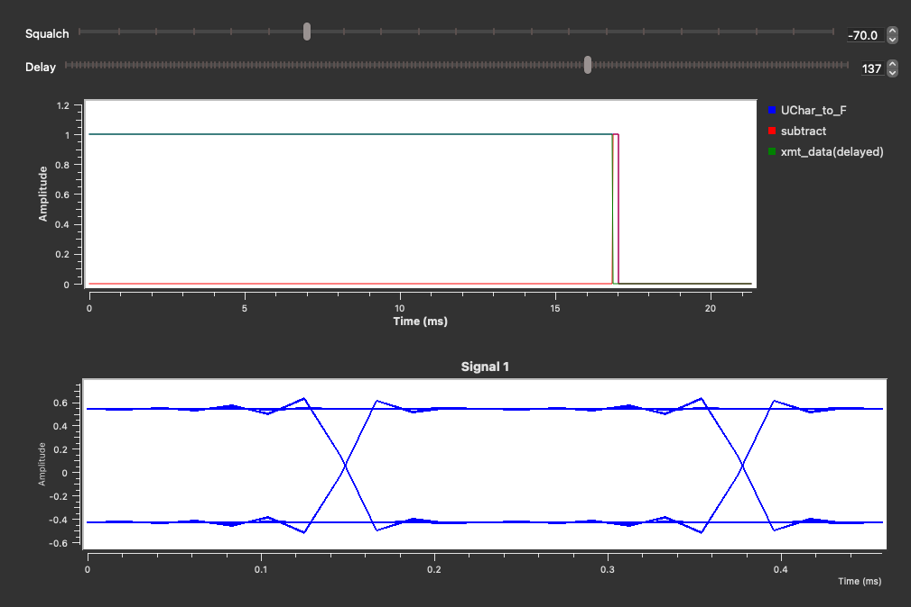

# GNU Radio 

This is a collection of scripts that I have used/transposed/copied, in order to try and further my understanding of Signal Processing.

## Requirements

You will need GNU-Radio which can be (at time) challenging to install. 

I am running on a Mac (M1 Silicon), and I resorted to using a custom *anaconda* package called **radioconda**. It worked well for me.

These scripts were run using GNU-Radio V3.10.11 

## FSK_8BIT.grc

FSK Transmitter, using 8 bit, but on Ham radio Space/Mark/Baud rate (45.45.

The *transmitted* data is then *received* and the bit streams compared. 

The flow graph looks like 

And the output when running looks like 

